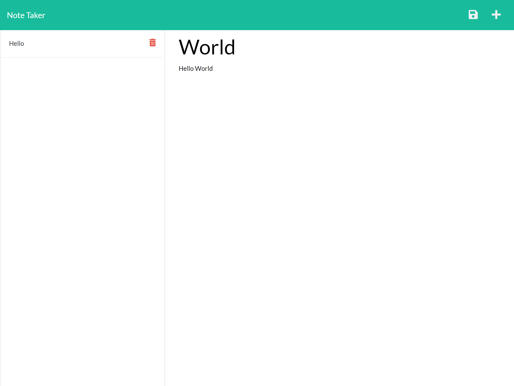

# NoteTab

<div align="center">
  
  
 
  
 
</div>

## Description 
Simple note app to store information with a backend.

<div style="display:flex; flex-direction: row;" >
 
</div>


## Table Of Contents 
 - [Installation](#installation) 
 - [Usage](#usage) 
 - [Languages, Libraries, and Frameworks](#languages)
 - [Contributor](#contributor)

## Installation 
 - Install using npm package manager. 
    - ```
        npm install
        ``` 

## Usage 
 - Run application using nodeJS.
    - ```
        node server.js
        ``` 

<div id='languages'></div>

## **Languages, Libraries, and Frameworks:**

| Technology | Type | Description |
| ----------- | ----- | -------- |
| [Javascript](https://www.javascript.com/) | Language | An object-oriented computer programming language. |
| [Bootstrap](https://getbootstrap.com/) | Framework | Open source toolkit for developing with HTML, CSS, and JS. |
| [Node.js](https://nodejs.org/en/) | Runtime Environment | An open source server environment. |
| [NPM - express](https://www.npmjs.com/package/express) | Module | A node package for creating a web framework in node. |


## Contributor 
 - **Eric Ng**  - [EricNg314](https://github.com/EricNg314) 
